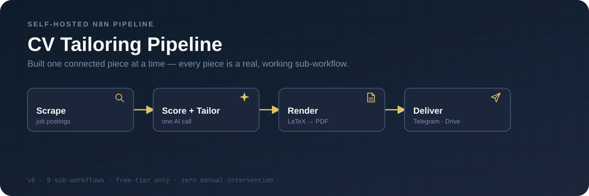
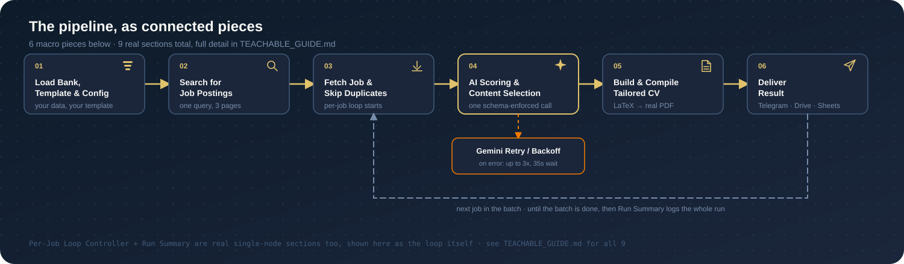
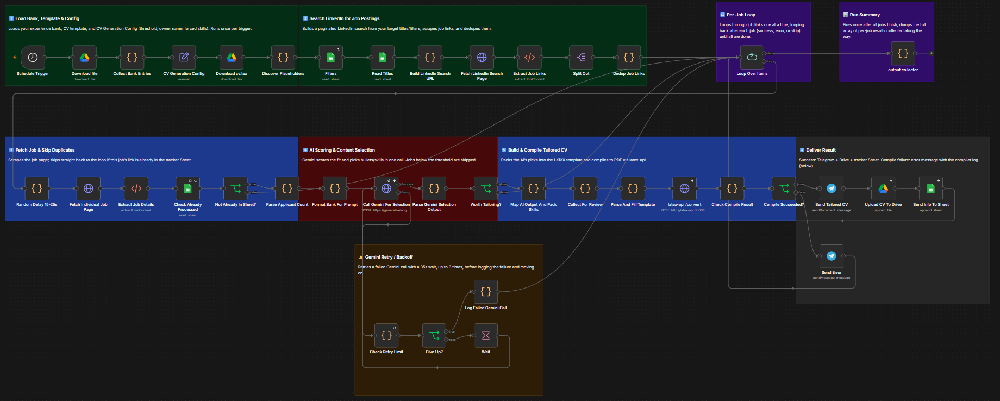

  

An n8n workflow that scrapes job postings, scores each one against your own
experience bank, tailors a CV for the ones worth applying to, compiles it to
a real PDF, and delivers it — daily, unattended, on free-tier infrastructure
only. This is the actual working build, not a simplified demo: every node,
every setting, every prompt.

## The pipeline, as connected pieces

  

Six macro pieces above; nine real sections underneath (two are single-node
and shown here as the loop itself). Every piece is a real sub-workflow you
can inspect, edit, or swap out independently — that's the actual reason
it's shown as connected Lego pieces instead of one wall of nodes.

### Full workflow canvas

  

The diagram above is the simplified map; this is what it actually looks like
wired up in n8n — every node, grouped into the same 9 sticky-note sections
[`TEACHABLE_GUIDE.md`](./TEACHABLE_GUIDE.md) walks through one by one. Use
it as the "what am I building toward" reference while working through that
guide.

## Getting started

The fastest path to a running workflow is steps 2 and 4 below — the JSON
already **is** the built workflow, you're not assembling it from scratch.
[`TEACHABLE_GUIDE.md`](./TEACHABLE_GUIDE.md) (step 1) exists so you know
what every node and credential does *after* importing it, and so you can
customize the prompt/template for your own field with confidence — not as a
literal from-scratch build sequence.

1. **Read [`TEACHABLE_GUIDE.md`](./TEACHABLE_GUIDE.md).** Node-by-node
   reference for all nine sections — node types, exact settings, full
   prompt/schema text, every code block, pasted as-is from the live
   workflow, not narrated. Start here to understand what you're importing
   in step 4, and to find the one clearly-marked place to customize the
   CV-tailoring prompt for your own field (not sales-specific — see
   "Why it's built this way" below).
2. **Fill in your own data:**
   - [`experience-bank/experience-bank.md`](./experience-bank/experience-bank.md)
     — replace the example entries with your own real, verifiable work
     history.
   - [`templates/CV2_placeholders.tex`](./templates/CV2_placeholders.tex) —
     replace the example header/education/experience with your own.
   - The `CV Generation Config` node (once imported, step 4) — set
     `cv_owner_name` to your own name; it's used in the generated PDF's
     filename.
3. **Stand up the infrastructure:** self-hosted n8n, a self-hosted service
   that compiles LaTeX to PDF ([`latex-api/`](./latex-api/) in this repo is
   a working example — start at
   [`latex-api/SETUP.md`](./latex-api/SETUP.md), which has a from-zero
   quickstart if you don't have a VPS/Docker stack running yet), an LLM API
   on a free tier, Google Drive/Sheets access, a Telegram bot.
   - Google Drive needs your filled-in `experience-bank.md` and CV template
     uploaded to it (step 2) — the workflow reads them from there, not from
     this repo.
   - Google Sheets needs one spreadsheet built from
     [`templates/job-search-sheet-template.xlsx`](./templates/job-search-sheet-template.xlsx)
     (import it via *File → Import* in Google Sheets, or open it directly in
     Excel first if you want to look before uploading). It has the three tabs
     the workflow expects — `Titles`, `Filters`, `Result` — with the exact
     column names already in place; the Sheets nodes reference columns by
     name, so a hand-built sheet with different column names will fail.
4. **Import [`workflows/embed-experience-bank.json`](./workflows/embed-experience-bank.json)**
   into your own n8n instance and point every credential and file/sheet ID
   at your own — they're placeholders in this export, not live values.

## Why it's built this way

Two mechanisms replaced approaches that looked reasonable but didn't hold
up in practice:

- **One schema-enforced AI call, not a LangChain chain.** n8n's
  `Basic LLM Chain` / `Structured Output Parser` and `AI Agent` node were
  both tried for structured output and found unreliable; a direct HTTP call
  to `generateContent` with a native `responseSchema` replaced them and
  stuck.
- **Placeholder substitution into a fixed LaTeX template, not AI-authored
  LaTeX.** Letting the model write the whole document caused repeated
  structural corruption; the model now only fills `<<TOKEN>>` placeholders
  in a template it can't otherwise break.
- **The tailoring prompt is field-agnostic, not sales-specific.** The
  scoring rubric and JD-signal categories derive from your own experience
  bank's role headers at runtime — a bank of nursing, engineering, or
  teaching roles gets scored and tailored against that field automatically,
  no prompt rewrite required. See the `Format Bank For Prompt` node in
  [`TEACHABLE_GUIDE.md`](./TEACHABLE_GUIDE.md#5-ai-scoring--content-selection)
  for the one small, clearly-marked block you can optionally edit to
  sharpen it further for your own field.

Full bug-by-bug history behind individual prompt rules:
[`WORKFLOW_GUIDE.md`](./WORKFLOW_GUIDE.md).

## Stack

- **Orchestration:** self-hosted n8n
- **Scoring + tailoring:** any LLM API on a free tier with schema-enforced
  JSON output (this build: Gemini)
- **PDF generation:** a self-hosted LaTeX-compiling service (this build:
  [`latex-api/`](./latex-api/), a small FastAPI service)
- **Delivery/archiving:** Google Sheets (tracking/dedup, one spreadsheet —
  template: [`templates/job-search-sheet-template.xlsx`](./templates/job-search-sheet-template.xlsx)),
  Google Drive (archive), Telegram (real-time delivery)

## Contents

| Path | What it is |
|---|---|
| [`TEACHABLE_GUIDE.md`](./TEACHABLE_GUIDE.md) | Start here — node-by-node reference for the imported workflow |
| [`WORKFLOW_GUIDE.md`](./WORKFLOW_GUIDE.md) | The "why" — decisions, bugs, history behind the current design |
| [`workflows/embed-experience-bank.json`](./workflows/embed-experience-bank.json) | The workflow itself — import this; credentials/IDs are scrubbed placeholders |
| [`experience-bank/experience-bank.md`](./experience-bank/experience-bank.md) | Blank template — fill with your own real work history |
| [`templates/CV2_placeholders.tex`](./templates/CV2_placeholders.tex) | Blank CV template — fill with your own header/education/experience |
| [`templates/job-search-sheet-template.xlsx`](./templates/job-search-sheet-template.xlsx) | Blank Google Sheet template (3 tabs: Titles, Filters, Result) — import into Google Sheets, don't build one by hand |
| [`latex-api/`](./latex-api/) ([`SETUP.md`](./latex-api/SETUP.md)) | Working example PDF-compiler service, with a from-zero deployment quickstart |
| [`assets/readme/full-canvas.png`](./assets/readme/full-canvas.png) | The real workflow canvas, all 9 sections, every node |

## Known open items

- Score threshold (`cv_tailor_threshold` in `CV Generation Config`) ships at
  a placeholder value, untested on your bank/template combination.
- JD-specific signal detection underperforms on some international-scope
  job descriptions.
- Bullet-selection can converge on the same generically-impressive bullets
  run after run — bank composition vs. model bias, still an open question.
- Applicant count is scraped but nothing filters on it yet.

## License

MIT — use, fork, adapt freely. If you build something on this, I'd like to
hear about it.
